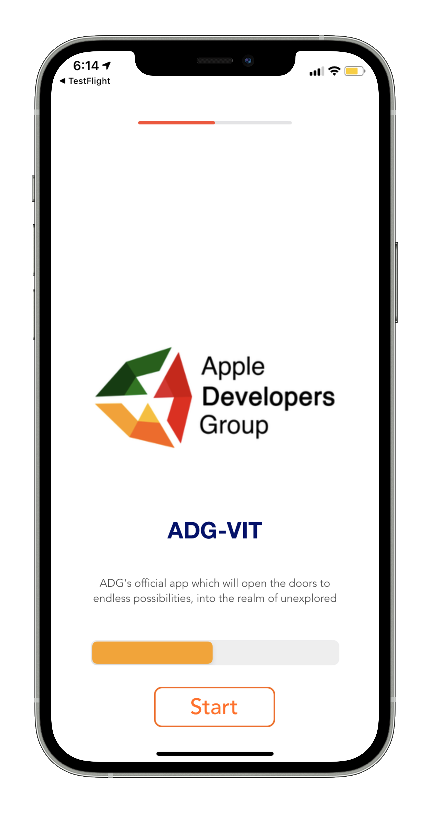
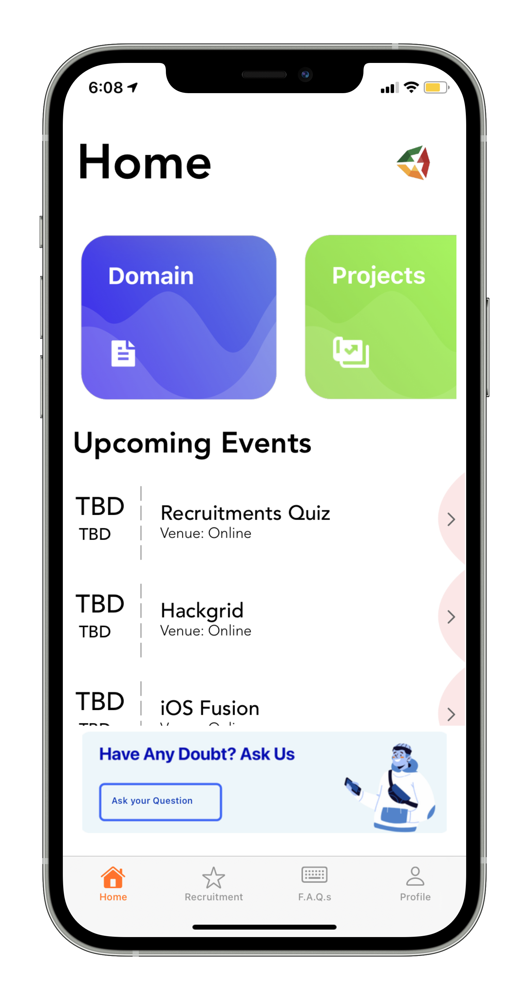
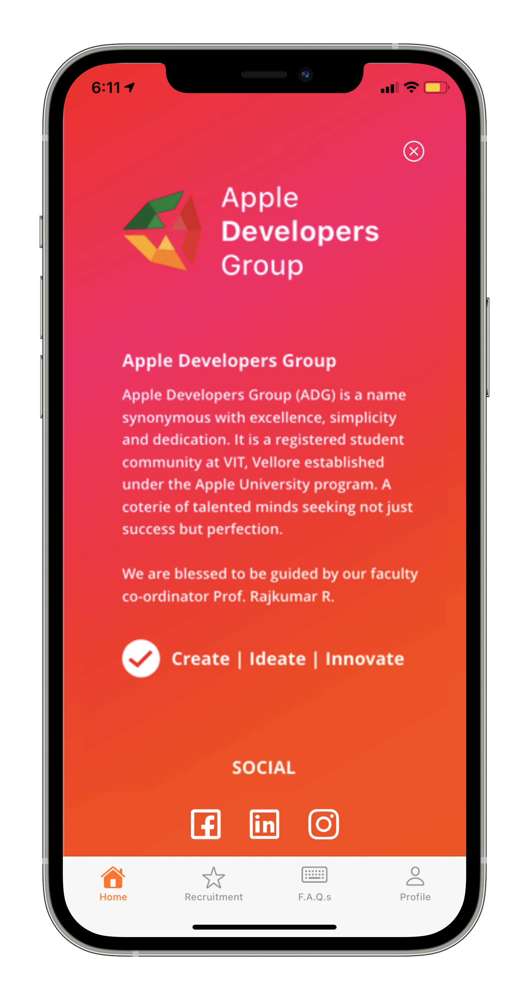
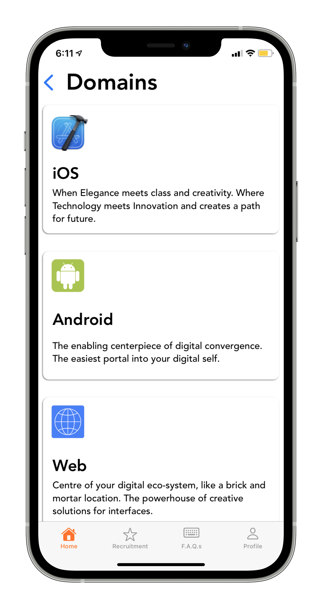
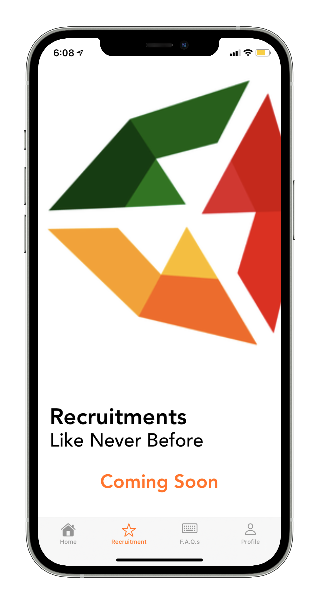
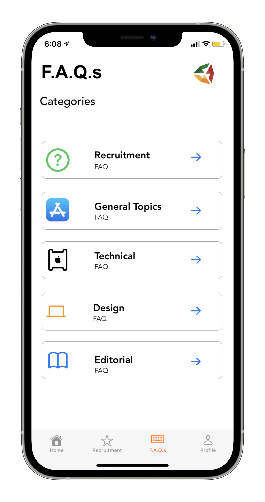
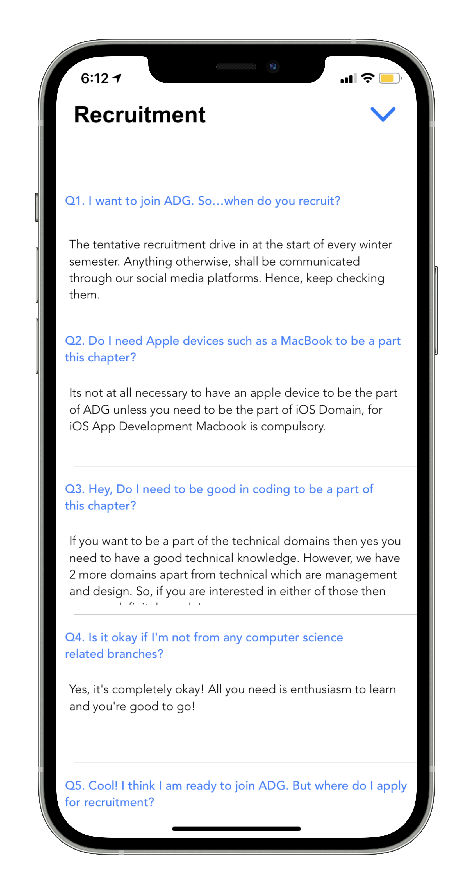
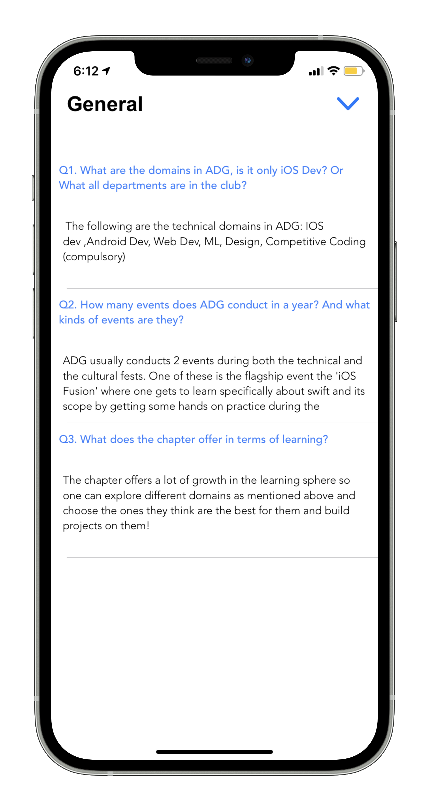
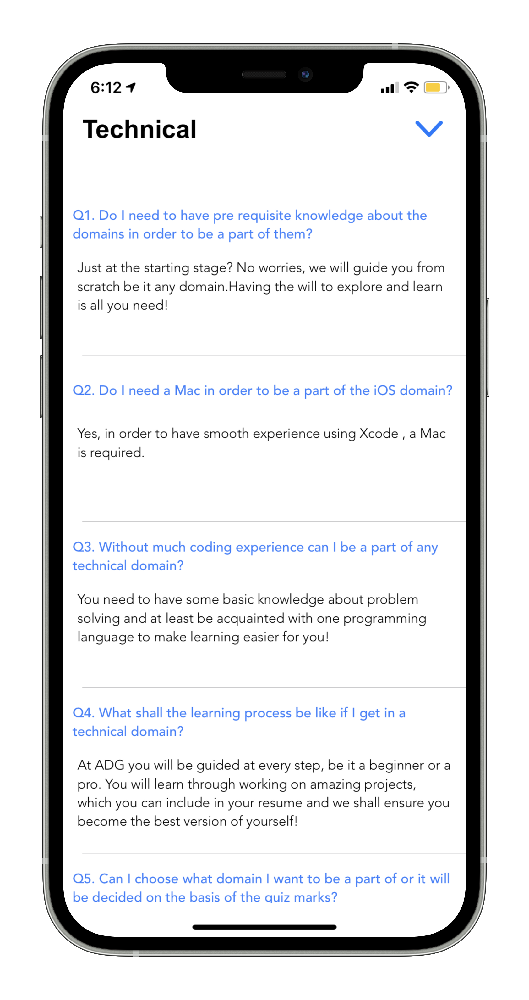
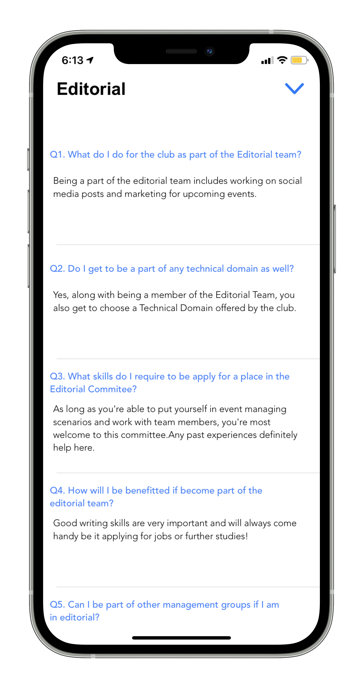

# ADG VIT

ADG-VIT is an application built to give an insight of what this community holds for you. It is one stop app for new **recruitments**, FAQ, events , projects , various domains and a lot more! [Apple developers group](https://adgvit.com) aims to provide the best learning experience to its members and believes that creativity comes with collaboration.

<a href="https://apps.apple.com/in/app/adg-vit/id1545733138">
  
</a>

# Snapshots

<p align = "centre">







<!-- 
 -->
  
</p>

## Features

- All the latest updates about Apple Developers Group VIT.
- All information about its domains, projects, events and team.
- **Recruitment made easier with interested candidates participating anytime,anywhere on the go.**
- FAQs that will solve all the doubts you might be having of Apple Developers Group VIT
- A journey that will cover all your expectations and take you to unexplored realm of possibilities.

## Requirements 
* Xcode 12+
* iOS 12+
*  Swift 5+

## License ⚖️
* ``` Do Read the [License](https://github.com/ADG-VIT/ADG-Externals-App-iOS/blob/rework/LICENSE) before proceeding ```
